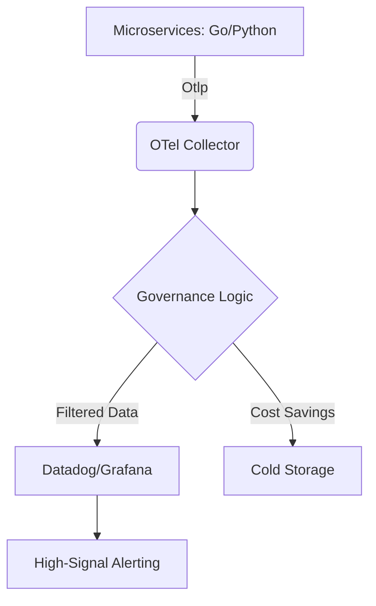

# Heya! 👋🏼
[cite_start]Thanks for visiting my profile. I am Shweta Tendulkar, fondly called Sia! 😄

## 🕵️‍♂️ Why am I here?
[cite_start]I’m a Staff Observability Architect who believes that if an alert doesn't wake me up for a good reason, it shouldn't exist. 
[cite_start]I specialize in turning "Vendor Lock-in" nightmares into OpenTelemetry dreams.

**My Philosophy:**
* [cite_start]**Signal > Noise:** I reduced MTTR by 25% at Deloitte not by adding more dashboards, but by deleting the useless ones[cite: 23].
* [cite_start]**ROM (Return-on-Monitoring):** If your observability bill looks like a phone number, we need to talk.
* **Chatpata SRE:** I like my telemetry like I like my Biryani—well-distributed, spicy enough to keep you alert, but not so hot it causes a 3 AM incident. 👩🏻‍💻

# OpenTelemetry (OTel) Governance & ROM Framework

## 🎯 Project Overview
[cite_start] This repository showcases a production-grade observability architecture designed to eliminate vendor lock-in and optimize **Return-on-Monitoring (ROM)**[cite: 7]. 
[cite_start] It focuses on high-signal telemetry to reduce alert fatigue—a strategy that has previously helped improve MTTR by 25% in enterprise environments[cite: 8, 23].

## 🛠 Tech Stack
* [cite_start]**Languages:** Python (managed via `uv`), Go [cite: 13]
* [cite_start]**Infrastructure:** Terraform, Kubernetes (K8s) [cite: 13, 14]
* [cite_start]**Observability:** OpenTelemetry (OTel), Prometheus, Grafana, Datadog [cite: 14]

## 🏗 Architecture-as-Code
[cite_start]The following diagram visualizes the telemetry pipeline, ensuring "Engineering-first" reliability[cite: 9]:

## 🛠 The "I’ve Seen Things" Tech Stack
* [cite_start]**Kubernetes:** CKA/CKS certified, yet still occasionally humbled by a YAML indentation error[cite: 11].
* **OpenTelemetry:** My love language. [cite_start]If it isn't instrumented, did the code even run? [cite: 7, 13]
* [cite_start]**Datadog/Splunk/Grafana:** I speak all these fluently, though my wallet prefers OTel[cite: 14, 28].

## 🚀 The "Staff" Edge: Strategy & Governance
Beyond the code, I focus on the operational health and financial sustainability of distributed systems. My approach is rooted in:

* **Return-on-Monitoring (ROM):** I treat observability as an investment. [cite_start]At Deloitte, I used cost modeling to justify vendor selection and platform spend, ensuring high signal without the "surprise" cloud bill[cite: 21].
* **MTTR Reduction (The 25% Rule):** I don't just build dashboards; I build service-centric visibility. [cite_start]By establishing organization-wide SLIs/SLOs and automated onboarding, I've consistently reduced Mean Time to Resolution by ~25%[cite: 8, 20, 23].
* [cite_start]**Governance & Compliance:** As an Accenture Governance & Compliance Champion (2024/2025), I design observability pipelines that meet regulatory standards while maintaining engineering velocity.
* [cite_start]**Engineering-First Leadership:** I bridge the gap between executive vision and SRE-aligned reliability management[cite: 9, 24].